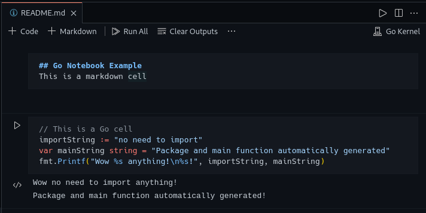
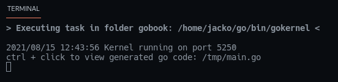
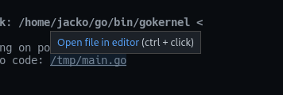
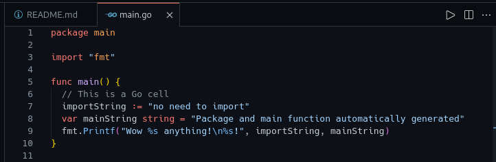
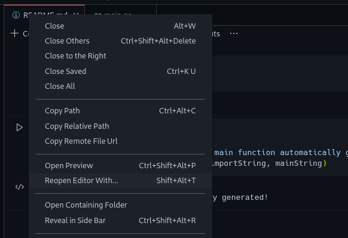
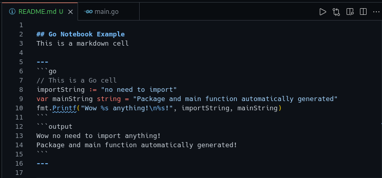
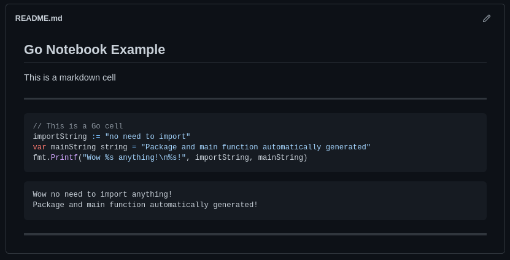

# Gobook: Go Notebook VS Code Extension

## Getting Started
Create a markdown `.md` or `.markdown` document and open it

If extension hasn't activated, right click on file, select "Open With..." and click gobook

Create a cell, write some Go and press the play button

It will then start a task running gokernel

To see the generated source code, ctrl + click the temp file

Right click the markdown file and reopen with text editor to see the markdown source code

Because the source code is standard markdown, it renders nicely on Github or blogging sites

## Notes
- If you are writing functions, put them in a separate cell, gokernel will put them outside the main function
- If you terminate the gokernel task, the next time you execute a cell it will start again. This can be used to restart the kernel
- On first execution it will check for gokernel and gopls updates with `go get` and install latest if required
- The kernel will be installed to `$GOPATH/bin/gokernel`, delete it to force a reinstall
- Code completion and full language server features are coming, but for now only the generated `tmp/main.go` works with gopls
- Keyboard shortcuts are located in File > Preferences > Keyboard Shortcuts. Type in 'Notebook:' to see everything available.

## Output Example
Check out [gobook.dev](https://gobook.dev) which was created using only markdown files generated from this extension.

## Kernel
The kernel is very simple [source code here](https://github.com/gobookdev/gokernel) 

## Development Status
### Working
- Add an option to activate extension with .md or .gobook files
- Activate extension as default when opening a .gobook file
- Syntax highlighting
- Save output of cells to file
- Reload output when reopening file
- Markdown formatting to represent code in and code out 
- Go kernel compiler to be 1 to 1 with normal Go
- Imports no longer required, kernel imports automatically

### In Development 
- Code completion / linting
- Auto format cells
- Variables explorer
- Export to PDF

### Future development
- Add support to execute JS, TS and Python code cells with additional kernels
- Shared state between all languages, i.e. initialize x in Python and use it in Go
